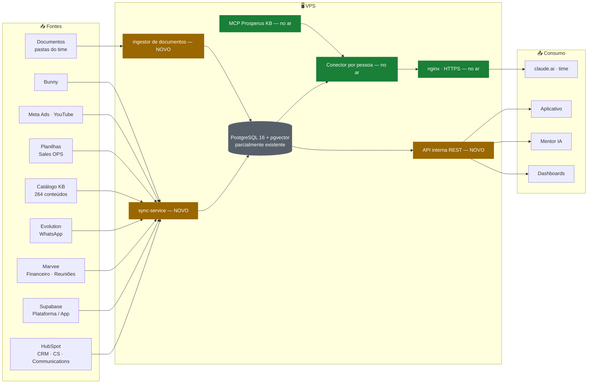

# Prosperus Data Hub — v2

## Complemento ao documento de arquitetura, com o que já está no ar

> Complemento ao [`data-hub-prosperus.md`](./data-hub-prosperus.md) (Ferrugem).
> Times: Tecnologia · CS · Sales OPS · Vendas.
> Infra: VPS Hostinger (Ubuntu 24.04 LTS, KVM 4 — 4 vCPU / 16 GB RAM).
> Levantamento por leitura de código e configuração no repositório em **11/08/2026**. Onde não deu para confirmar ao vivo no servidor, está marcado **(a confirmar)**.

---

## 0. Como ler este documento

O documento original está certo no destino e a arquitetura se sustenta. O que este complemento faz é **mover o ponto de partida**: boa parte da Fase 1 e da Fase 2 já existe, em produção, com as arestas já lixadas. O ganho não é economizar código — é **não reabrir decisões que já custaram caro** e **não criar uma segunda verdade ao lado da primeira**.

Três das quatro decisões-chave do plano já são realidade parcial:

| Decisão do plano | Situação real hoje |
|---|---|
| PostgreSQL + pgvector | **Já em uso.** Duas bases pgvector em produção, 768 dimensões, busca híbrida com RRF. O Postgres 16 do próprio host já roda pgvector |
| Servidor MCP read-only | **Já industrializado.** ~13 conectores no ar, um por pessoa, com painel de provisionamento e read-only imposto por systemd |
| VPS próprio | Sim — mas em **systemd, não em Docker Compose** |
| ETL próprio em TypeScript | **Único item sem sobreposição. Construir** |

E o valor real do Data Hub fica mais nítido quando se olha o que **não** existe: não há `cliente_id` estável, não há tabela de eventos, e as seis frentes que já capturam evento não referenciam um id comum. **É esse buraco que trava toda pergunta analítica hoje.**

---

## 1. Objetivo

Mantido integralmente. Os três formatos de saída — consulta em linguagem natural, APIs para aplicações e visão única da jornada — continuam sendo o alvo.

Um ajuste de ênfase: **a visão única da jornada é o objetivo primário**, e os outros dois são consequência. Consulta em linguagem natural sobre conteúdo já existe e funciona; sobre jornada, não existe. O primeiro entregável que muda o dia do time é **uma linha do tempo por cliente**, não um dashboard.

---

## 2. Arquitetura geral



**Verde = existe hoje. Âmbar = construir.**

### Decisões-chave, revisadas

| Decisão | Escolha original | Situação real | Recomendação |
|---|---|---|---|
| Banco central | PostgreSQL 16 + pgvector | Postgres 16 com pgvector já roda no host; duas bases pgvector em produção no Supabase | **Manter.** Criar *database* no host, não subir infraestrutura nova — a menos que se queira isolamento forte, aí o container se justifica sozinho |
| ETL | sync-service próprio em TypeScript | Não existe nada equivalente | **Manter, sem ressalva.** É o item de maior valor incremental |
| Camada de IA | Servidor MCP read-only | Padrão já industrializado, com painel de provisionamento e rollback | **Manter o padrão** — mas como **módulo do conector que cada pessoa já tem**, não como conector novo (§5.1) |
| Hospedagem | VPS próprio em Docker Compose | Tudo que é nosso roda em systemd direto; não há um único docker-compose.yml versionado | **Decidir conscientemente (§7).** Compose não é errado; é uma segunda doutrina operacional convivendo com a primeira |

---

## 3. Fontes de dados e forma de ingestão

### 3.1 Dados estruturados → tabelas SQL

| Fonte | O que entra | Estado hoje | Observação |
|---|---|---|---|
| **HubSpot** | Contatos, negócios, pipelines, tickets, atividades | **Leitura já existe** | Integração read-only por API v3/v4 com Private App token. Nunca cria nem atualiza. Existe caminho de escrita separado (enroll em sequences) em outro serviço |
| **Supabase** (plataforma/app) | Membros, acessos, eventos do app | **Só de fora para dentro** | Hoje nós enviamos para o app por Edge Function assinada (`sla-ingest`, `receive-trilha`, `receive-jornada`). Não lemos o Postgres do app. A leitura direta Postgres → Postgres depende de acesso e liberação que não temos |
| **Marvee** | Financeiro, reuniões | **Leitura já existe** | Backend real é `api.funnelpulse.com.br`. Traz reuniões, dor / objetivo / direcionamento, BANT e transcrição crua. Cuidado: a API corrompe acentos na origem, o que exige comparação tolerante |
| **Planilhas** | Controles do Sales OPS | Não existe | Nenhuma integração Google própria na casa |
| **Meta Ads** | Campanhas, custo, leads | Parcial | Chamadas à Marketing API existem dentro do squad de tráfego, sob demanda. Não é ingestão contínua |
| **Bunny.net** | Views, watch time, geografia | **Bloqueado na origem** | A conta venceu e a library foi apagada. O job diário não tem de onde ler até isso ser resolvido |
| **YouTube** | Métricas de canal | Não existe | Só extração de áudio por yt-dlp para transcrição |
| **Git / GitHub** | Commits, PRs, issues | Não existe | — |
| **Catálogo de conteúdo** | Aulas, ids, vínculo com vídeo | **Já é fonte de verdade** | Ver §7 do original e §4.3 aqui |

### 3.2 Dados não estruturados → documentos + embeddings

| Fonte | Estado hoje | Observação |
|---|---|---|
| **WhatsApp** | **Existe, por outro canal** | Toda a operação roda em **Evolution self-hosted**, não Meta Cloud API. Ver §3.3 |
| **Transcrições de aula** | **Esteira completa e madura** | Curseduca (manifesto + áudio por HLS com Referer obrigatório), Hotmart (legenda WebVTT nativa), YouTube. Transcrição por NotebookLM com piso de densidade de 600 caracteres por minuto |
| **Transcrições de reunião** | Existe | Via Marvee |
| **E-mails** | Não existe | Nenhuma integração Workspace própria |
| **Pastas de computadores** | Não existe | Ver ressalva em §7.4 |

> **Extração de documento — atenção:** a casa não tem extrator próprio de PDF, DOCX, PPTX ou XLSX. O que existe são scripts que **geram** PPTX e PDF. O ingestor da Fase 3 seria a primeira biblioteca de extração de entrada da empresa — não há nada para reaproveitar aí, e vale dimensionar como tal.

### 3.3 WhatsApp — a decisão que precisa sair antes da Fase 2

O plano prevê Meta Cloud API. A operação hoje roda em **Evolution self-hosted**, com três serviços em produção dependendo dela: leitura de conversa e grupos, transcrição de áudio por webhook, e o cálculo de SLA de primeira resposta, que lê o Postgres da própria Evolution.

A migração para a API oficial tem mérito real: elimina o risco de banimento, acaba com a normalização de nono dígito e de identificador alternativo, e faz WhatsApp e e-mail caírem no mesmo lugar. Se isso acontecer, o ETL simplifica bastante — em vez de ler Postgres da Evolution mais Gmail API mais webhook da Meta, lê **HubSpot Communications**, onde o contato já vem resolvido. Vale notar que o pipeline de logs de CS já escreve em HubSpot Communications com canal `WHATS_APP` desde 13/07, e já existe um número nativo Meta Cloud dentro do HubSpot em uso como portão de bot.

O custo não é de integração, é de capacidade: a Cloud API **não opera grupos** — o webhook de transcrição de grupo morre — e fora da janela de 24 horas só se envia template aprovado e pago, o que muda o processo do CS.

**Encaminhamento sugerido: híbrido explícito.** Evolution permanece para grupos e como arquivo histórico; números de CS migram um a um, com piloto de 30 dias. A biblioteca de regra de negócio do SLA (relógio comercial, detecção de disparo em massa, janelas offline, expressões leves) não se descarta — **porta-se a regra, troca-se a fonte do carimbo de tempo**.

### 3.4 CIS Assessment — perfil comportamental *(adendo 12/08/2026)*

Fonte adicionada ao escopo: **CIS Assessment**, operado como whitelabel em `perfil.salesprime.app`, monta o **perfil comportamental** dos leads/clientes. É o dado por trás de duas peças que já existem na jornada:

- A etapa **"Devolutiva de perfil — análise comportamental"** (etapa 2 do Exclusive, antes da Dani);
- O **perfil comportamental que o vendedor consulta antes/durante a reunião** (caso de uso §11.3) e a camada de autodiagnóstico da base do lead.

**Levantamento do painel realizado em 12/08/2026** (conta Empresa; plataforma `CIS Assessment 1.4.5-beta.7`, backend interno `api.aws.cisassessment.com.br`):

| Aspecto | Resultado do levantamento |
|---|---|
| API / webhook de saída | **Não existem.** Sem menu de desenvolvedor, tokens ou webhook "avaliação concluída → sua URL". A API interna observada no tráfego não é documentada — integração direta seria não oficial e frágil |
| Caminho oficial de ingestão | **Export XLSX/CSV** (testado): 1 linha por inventário respondido, **44 colunas** — id, name, email, gender, cpf, campanha (`passport`), `discProfile`, DISC Natural + Adaptado (0–100), 4 estilos de liderança, 6 valores, 16 competências (Natural), datas (serial Excel). ~5.492 respondidos no ambiente. **Sync-service importa periodicamente, dedupe pelo `id` do inventário** |
| O que o export NÃO traz | Percepção/Exigência (geral e por ambiente), tipos psicológicos (Jung, ex. ENF), índices Positividade/Estima/Flexibilidade, textos do relatório e os 24 pares bipolares — só existem no relatório/PDF autenticado. Se forem necessários ao dossiê, é captura à parte (ou pedido de evolução ao CIS) |
| Vínculo | **E-mail é a chave de negócio** (campo imutável do cadastro no CIS); IDs numéricos estáveis (`personId`, `passportId`, `inventoryId`) nas URLs. CPF existe mas frequentemente vazio |
| Notificação de conclusão | Só para humanos (e-mail/WhatsApp: "Questionário respondido") — não serve de gatilho de sistema. Ingestão é batch |
| Entrada automática | Webhooks de **venda** (Pagarme/Hotmart/Guru) disparam o envio do assessment por campanha — útil para automatizar o envio no fechamento, não para ler resultados |
| Evento na jornada | `assessment_concluido` gerado pelo sync ao importar inventário novo — carimba a etapa "Devolutiva de perfil" (batch, não tempo real) |
| LGPD | Export inclui `gender` e `cpf`: **ingerir só com uso definido** (minimização). Acesso restrito por perfil: vendedor vê o do próprio lead; sem exposição no app do sócio sem consentimento |

Modelagem detalhada da tabela `perfis_comportamentais` (colunas promovidas + JSONB): na [spec da Jornada](./data-hub-jornada-mentorado-spec.md).

---

## 4. Modelo de dados central

### 4.1 O eixo da tabela de eventos precisa de uma decisão antes do schema

O plano alinha `eventos_jornada` às 10 fases da Jornada do Cliente. Duas coisas importam aqui:

**A boa notícia:** as 10 fases **já são legíveis por máquina**. Existe um índice JSON com `id`, `titulo`, `fase_num` de 0 a 10, `resumo`, `origem`, `fonte_url`, `status` e `atualizado_em`, mais 22 SOPs operacionais do HubSpot. É espelho datado do site vivo mantido pelo RevOps, com sincronizador próprio e servido por uma tool de MCP. **Semeie o enum a partir desse arquivo, não à mão** — isso mata a classe inteira de bug "o RevOps mudou a jornada e o banco não soube".

**A ressalva:** há uma leitura registrada em 09/08 de que essas 10 fases são **funil interno por time** — as seis primeiras acontecem antes de a pessoa virar cliente. O análogo real de linha do tempo do cliente seria a **jornada de 12 meses do CS, com 11 marcos**. Não é bloqueio, mas o eixo precisa ser escolhido: funil comercial, ciclo de vida do cliente, ou os dois em colunas separadas. **Provavelmente os dois.**

### 4.2 Identidade: já resolvida em runtime, falta persistir

**Não construa a resolução de identidade do zero.** Existe hoje, testado em produção:

- Um **construtor de dossiê** que monta o registro unificado a partir de HubSpot, WhatsApp, Marvee e base de conhecimento, com confiança graduada (`alta` / `media` / `sem_match`) e mascaramento de PII dos candidatos alternativos.
- Uma **cascata de descoberta de e-mail** que nunca escolhe em silêncio.
- A regra que mais dói e que já está codificada: **o contato de um negócio no HubSpot costuma resolver para o vendedor, não para o cliente.** A cascata filtra vendedor e domínios internos.
- Uma **"base do lead" em três camadas** — autodiagnóstico, trilha montada pelo CS e comportamental — com chave em e-mail. Match por nome foi explicitamente descartado.

O que realmente **não** existe:

- **`cliente_id` estável.** Convivem identificador de contato do HubSpot, e-mail, slug de trilha e id de membro.
- **Dedupe por CNPJ.** Zero. O único código de CNPJ na casa é de prospecção, não de identidade.
- **Tabela persistida.** Tudo é montado a cada chamada.

Uma decisão nossa que o plano precisa **reverter de forma consciente**: está escrito na documentação da base do lead que *não se cria store consolidado*, porque duplicaria verdade e criaria sincronização para manter. A tabela `clientes` contraria isso. Pode estar certa — o custo de montar em runtime é justamente não conseguir fazer pergunta analítica. Mas a reversão precisa ser explícita, com **o resolvedor existente virando a fonte do `cliente_id`**, e não uma segunda lógica de identidade nascendo ao lado da primeira.

### 4.3 Schema, com o que já existe marcado

```
clientes            NOVO — registro unificado persistido
                    ├─ id: cliente_id estável (o buraco central de hoje)
                    ├─ resolucao: delegada ao resolvedor existente, não reimplementada
                    └─ chave primária de match: e-mail (CNPJ não existe hoje)

eventos_jornada  ★  NOVO — a peça de maior valor do plano inteiro
                    (cliente_id, fase_funil, marco_cs, tipo_evento, data, origem, payload)
                    enum de fase semeado do índice JSON da jornada, não escrito à mão
                    todo evento carrega o piso de confiabilidade da fonte (ver Anexo C)

negocios            PARCIAL — leitura de deals já existe, falta persistir
tickets             PARCIAL — idem
financeiro          PARCIAL — leitura da Marvee já existe, falta persistir

academy_videos      QUASE PRONTO — o catálogo já carrega lessonId e videoId por aula
academy_metricas    BLOQUEADO — depende de resolver a conta Bunny
academy_eventos     NOVO — instrumentação por membro; a parte que mais vale

documentos          NOVO — é a camada de serviço que falta ao ETL de conhecimento
chunks              EXISTE EM OUTRA FORMA — ver §9
```

### 4.4 Uma dependência parada do nosso lado

Existe uma **migration escrita e validada duas vezes** contra Postgres 16 real — 12 tabelas, 29 policies — que inclui um **log de eventos de jornada**, o análogo mais próximo de `eventos_jornada` já modelado aqui. Nunca foi aplicada. Antes de escrever schema novo, vale definir se ela entra, se é substituída pelo Data Hub, ou se as duas coexistem.

---

## 5. Como consultar os dados

### 5.1 Time — o padrão de conector já existe, com três regras

O conector por pessoa não precisa ser inventado. Hoje:

- **Um único servidor composto é montado por pessoa**, e os módulos ligam e desligam por arquivo de ambiente. Módulo desligado significa zero tool e zero instrução no contexto. Isso é exatamente o "perfis de acesso por time" da Fase 2, **já implementado**.
- **Um painel provisiona a pessoa inteira**: gera ambiente, unit do systemd e location do nginx, testa a configuração, faz health check com retry, e só grava no registry se tudo passou — falhou, faz rollback.
- **Read-only é imposto pela infraestrutura**, não pela boa intenção: a unit usa `ProtectSystem=strict` com caminhos somente-leitura, e as tools carregam a marcação de somente leitura.
- Cada pessoa tem uma **página própria** onde vê o conector dela, liga os próprios módulos e copia as instruções.

**Três regras da casa que o Data Hub precisa respeitar:**

1. **Workflow novo é módulo do conector pessoal, nunca link novo.** Está escrito em quatro documentos diferentes. Um conector "data-hub" que cada pessoa instala além do dela quebra o padrão e dobra a superfície de manutenção.
2. **Existe teto de tools.** Acima de aproximadamente 15 tools, o Claude cai em busca de ferramenta instável e elas deixam de ficar pré-carregadas. A base de conhecimento foi deliberadamente enxugada de 15 para 10 por causa disso. As 4 tools propostas cabem, mas **contam contra o orçamento da pessoa**, que hoje vai de 8 a 18 dependendo da função.
3. **Nome de tool é namespace compartilhado.** `buscar_semantico(texto)` já existe com esse nome exato no conector da base de conhecimento. Duas tools homônimas sobre corpora diferentes deixam o time sem saber qual chamar. Ou a do Data Hub muda de nome, ou as duas se fundem.

**Tools propostas, revisadas:**

| Tool | Situação | Observação |
|---|---|---|
| `jornada_do_cliente(email)` | **Nova, e é a que justifica o projeto** | Chave por e-mail está correta: é a chave real da casa hoje |
| `consultar_sql(pergunta)` | Nova | Precisa de views seguras e limite de linhas. É a tool de maior risco de custo de contexto |
| `buscar_semantico(texto)` | **Colide com tool existente** | Renomear ou fundir |
| `metricas_academy(periodo)` | Nova | Depende de instrumentação e da conta Bunny |

### 5.2 Aplicações — API interna REST

Mantido. Um acréscimo: hoje a comunicação com o app dos sócios é feita por **Edge Function assinada com HMAC**, e esse padrão já está em produção em três fluxos. Vale decidir se a API REST substitui esse caminho ou convive com ele — **duas portas de entrada no mesmo app é dívida garantida**.

### 5.3 Mentor IA no aplicativo

Mantido, com uma sugestão forte de reúso: o **padrão de copiloto isolado por tenant já roda em produção**. Existe um servidor que serve, por pessoa, um bundle isolado com busca híbrida própria, rodando sob usuário dedicado e compartimentado no sistema de arquivos. É o molde certo para o mentor do membro — melhor do que expor o banco central inteiro à sessão de um cliente final.

---

## 6. Segurança e LGPD

O capítulo original está bem desenhado. Quatro acréscimos vindos da operação:

| Ponto | Complemento |
|---|---|
| **Autenticação** | O padrão atual da casa é segredo no caminho da URL, com `X-Robots-Tag: noindex` como defesa em profundidade. Funciona para material interno, mas é credencial que não expira e vaza junto com o link. O Data Hub serve jornada, conversa e financeiro de cliente identificado: **deve nascer com token real ou OAuth**, não herdar o padrão de path |
| **Minimização** | Precisa de **regra escrita por fonte**, não princípio geral. O caso duro é conversa de WhatsApp: já existe uma política concreta — uma observação por conversa por dia, citação apagada aos 90 dias, linha inteira aos 24 meses. É esse nível de especificidade que o schema precisa carregar por tabela |
| **Procedência no dado** | O registro unificado atual carrega confiança de identidade e lista de fontes. Se a tabela `clientes` perder isso, a IA passa a responder com certeza sobre um match que era só provável |
| **Piso histórico** | Ver Anexo C. Se a tabela não carrega o piso de confiabilidade da fonte, o dashboard vai reportar uma queda que nunca aconteceu |

---

## 7. Stack no VPS

### 7.1 Docker Compose × systemd

Tudo que é nosso roda como **unit do systemd** direta em loopback, atrás de nginx, com hardening pesado — `ProtectSystem=strict`, caminhos inacessíveis, compartimentação por uid — e provisionamento automatizado. Docker existe no host, mas só para software de terceiros: WordPress, phpMyAdmin, Evolution. Não há um único docker-compose.yml versionado no repositório.

Compose não é errado. Mas passa a ser uma **segunda doutrina operacional** convivendo com a primeira: dois jeitos de subir serviço, dois de ler log, dois de aplicar hardening. Se a escolha for Compose, vale ela ser explícita e vir com a resposta de quem opera o quê.

**Lição específica que vale herdar:** um deployer que gera unit precisa gerar a unit **já endurecida**. Aconteceu aqui de um script de deploy reescrever a unit e desfazer o hardening no restart seguinte, em silêncio.

### 7.2 pgvector já está no host

O banco de memória de um dos agentes roda pgvector no Postgres 16 do próprio servidor, com reserva de memória declarada no systemd. **A Fase 1 é criar um database, não subir infraestrutura.**

### 7.3 A caixa tem histórico

A máquina foi upgradada em 05/08 para 4 vCPU e 16 GB — a especificação do documento original está certa, e é a nossa documentação interna que está velha. Ainda assim, três fatos operacionais:

- Em 10/08 a máquina foi a **100% de swap** por processos órfãos; existe hoje um watchdog rodando de 3 em 3 minutos matando processo travado.
- A Evolution divide CPU com build do app; já houve alerta de limitação de CPU no painel do provedor.
- **Não existe backup completo agendado.** Só backups pontuais antes de mudança de risco.

Duas implicações: **dimensionar `MemoryMax` por serviço desde a primeira unit**, e tratar o **dump diário com retenção externa como entrega de destaque** — seria a primeira política de backup real da casa, não um detalhe de rodapé.

### 7.4 Sobre o Syncthing

Tecnicamente é a solução certa para o problema. A ressalva não é técnica: sincronizar pasta de máquina pessoal significa que documento não relacionado a trabalho pode entrar no índice e ficar pesquisável por outras pessoas via IA. A mitigação prevista — cada pessoa escolhe as pastas — é real, mas depende de disciplina individual. Sugestão: tratar como **adesão por pessoa com consentimento explícito**, começar só por **pastas de equipe**, e deixar a via Drive/OneDrive como padrão para quem preferir.

### 7.5 Faixas de porta já ocupadas

Serviços internos rodam em loopback atrás do nginx. As faixas abaixo estão em uso ou reservadas **(a confirmar ao vivo antes de alocar)**:

| Faixa | Uso |
|---|---|
| 3000–3010 | App principal (auth, api, upload) e health |
| 8080 / 8081 | WordPress e phpMyAdmin (Docker) |
| 8765 / 8766 | Base de conhecimento e conector de contexto |
| 8767–8774 | Conectores legados por pessoa |
| 8776 / 8777 | Trilha (MCP e API HTTP) e Proposta |
| 8769 | Webhook de transcrição de áudio |
| 8778–8779, 8785–8786 | Apps de campanha |
| 8780–8799 | Faixa do provisionamento automático de conectores por pessoa |
| 8790 | Painel de gestão |
| 8791–8793 | Apps de campanha |
| 8800–8899 | Reservada: copilotos por mentorado |
| 8900–8949 | Reservada: acervos |

**Sugestão: alocar o Data Hub fora dessas faixas**, para não colidir com o alocador automático do painel.

---

## 8. Fases de implantação

Não é contraproposta de arquitetura — é **reordenação por dependência e por risco**.

### Fase 0 — quatro decisões, antes de qualquer código

- [ ] Eixo da `eventos_jornada`: funil comercial de 10 fases, ciclo de vida do CS de 11 marcos, ou os dois em colunas separadas
- [ ] `clientes` persistida × montagem em runtime — e, se persistida, o resolvedor existente vira a fonte do `cliente_id`
- [ ] Canal de WhatsApp: Cloud API, Evolution, ou híbrido com fronteira escrita
- [ ] Destino da migration de 07/08 que já modela o log de eventos de jornada

### Fase 1 — o núcleo que só o Data Hub resolve

- [ ] Database no Postgres do host; schema com `clientes` e `eventos_jornada`
- [ ] Enum de fase semeado do índice JSON, com o sincronizador existente mantendo-o vivo
- [ ] `cliente_id` estável, com o resolvedor atual como fonte
- [ ] Sync de HubSpot — a fonte mais rica e a única com escrita já mapeada
- [ ] Absorver o que hoje é SLA e log de relacionamento, declarando o piso de 11/06/2026
- [ ] **Primeira consulta útil ao time, antes de qualquer dashboard**

### Fase 2 — Academy

- [ ] Costurar o identificador do Bunny ao id do catálogo (o catálogo já tem `lessonId` e `videoId`; falta só o `guid` da migração)
- [ ] `academy_videos` derivada do catálogo **por job**, nunca editada à mão
- [ ] Instrumentar o player por membro — a parte que não existe e que vale mais
- [ ] Resolver a conta Bunny antes de prometer métrica agregada

### Fase 3 — interações e conhecimento

- [ ] Depende da decisão de canal de WhatsApp
- [ ] E-mail via HubSpot, se o HubSpot virar o barramento de interação
- [ ] `documentos` e `chunks` desenhados para receber também as KBs destiladas (§9)
- [ ] Syncthing com adesão por pessoa

### Fase 4 — superfícies

- [ ] Módulo MCP **dentro do conector existente**, dentro do orçamento de tools
- [ ] Mentor IA reusando o isolamento por tenant que já roda
- [ ] Dashboards por último

---

## 9. Os dois ETLs não são o mesmo ETL

Vale separar, porque a palavra colide e isso já gerou confusão:

- **ETL de conhecimento** (o framework que a casa usa): bruto → base destilada → skill → agente. Pipeline conduzido por IA, com aprovação humana antes de compor, separação entre quem compõe e quem audita, e proveniência inline obrigatória. **Continua sendo o caminho para conhecimento.**
- **ETL de dados** (o sync-service do plano): sistemas → tabelas. **Não existe hoje e não conflita com o de cima.**

Onde os dois se encontram, e isso é ganho real: o ETL de conhecimento termina entregando markdown numa pasta, e a regra interna **proíbe referenciar aquela pasta em tempo de execução**. Resultado: cada consumidor copia e re-sintetiza à mão, e todo projeto que quis busca de verdade construiu a stack do zero. As tabelas `documentos` e `chunks` mais o ingestor são, sem querer, **a camada de serviço que falta a esse pipeline**. Se forem genéricas o suficiente para receber uma base destilada, resolvem dois problemas com um serviço.

---

## 10. Resumo executivo

- **O destino está certo.** O que muda é o ponto de partida: pgvector, busca híbrida e o padrão de conector MCP já estão em produção e não precisam ser reabertos.
- **O valor do projeto está em duas coisas que de fato não existem**: um `cliente_id` estável e a tabela de eventos. Hoje há seis silos de evento e nenhum referencia um id comum.
- **Quatro decisões precisam sair antes do schema** — eixo da jornada, `clientes` persistida, canal de WhatsApp e destino da migration parada.
- **Duas escolhas de infraestrutura merecem discussão explícita**: Docker Compose ao lado do systemd, e autenticação por token de verdade em vez do segredo no path.
- **Três entregas do plano são inéditas e valiosas por si**: o sync-service, a instrumentação do Academy por membro e a primeira política de backup real da casa.

---

## 11. Casos de uso do ecossistema *(adendo 12/08/2026)*

O princípio que amarra tudo: **os dados moram uma vez no Postgres central; a IA chega neles por tools MCP (pessoas) e pela API (aplicações)**. Cada caso de uso abaixo é uma combinação diferente das mesmas peças — nenhum exige banco novo.

### 11.1 Sócio no app — trilha, conteúdo e ROI

*"Quais vídeos ou documentos ajudam o Sócio na trilha e na rotina para gerar ROI"*

| Peça | Estado |
|---|---|
| Catálogo + grafo de dores→aulas (KB, 264 conteúdos) | ✅ Produção |
| Trilha montada pelo CS por cliente | ✅ Produção (publicação de trilha) |
| Molde do copiloto isolado por tenant | ✅ Produção — é o padrão para o mentor do Sócio |
| **O que o Sócio já assistiu/concluiu** (`academy_eventos`) | ❌ **O elo que falta** — hoje o progresso de trilha mora no navegador dele (Anexo C) |

Com `academy_eventos` + a trilha + o grafo da KB, o mentor responde: *"você está no marco 3 da sua trilha; a próxima aula recomendada para a sua dor é X"*. **ROI vira métrica**: consumo → marcos atingidos → resultado declarado nas reuniões (a Marvee já traz dor/objetivo/BANT).

### 11.2 Desempenho do CS com os Sócios

| Peça | Estado |
|---|---|
| SLA de primeira resposta (relógio comercial, piso 11/06) | ✅ Produção — absorver na Fase 1 |
| Log de relacionamento (voz do CS → HubSpot Communications) | ✅ Produção |
| Jornada de 12 meses com 11 marcos do CS | ✅ Documentada — reforça o **eixo duplo** da Fase 0 |
| Linha do tempo por Sócio (`eventos_jornada` + `cliente_id`) | ❌ O que o Data Hub cria |

O fluxo de desempenho vira consulta: por CS, a carteira de Sócios com marcos atingidos × prazo, SLA de resposta, engajamento no Academy e renovação/churn. Sai primeiro como tool (`consultar_sql` para a liderança), depois como dashboard.

### 11.3 Vendedor antes e durante a reunião

| Peça | Estado |
|---|---|
| Dossiê unificado em runtime (HubSpot + WhatsApp + Marvee + KB, com confiança) | ✅ Produção — closers já têm HubSpot/Marvee/Proposta no conector |
| **Perfil comportamental**: autodiagnóstico (base do lead) + BANT/dor/direcionamento (Marvee) | ✅ Existe, espalhado |
| Histórico persistido para "o que oferecer" (entregas × perfil) | ❌ Data Hub: com a jornada persistida, dá para responder *"clientes com esse perfil fecharam mais quando a oferta foi X"* |

A tool `jornada_do_cliente(email)` é o "buscar sobre o cliente antes/durante a reunião" — e, com a Marvee transcrevendo a call, o passo seguinte natural é o copiloto sugerir entregas em tempo real com base no perfil + catálogo.

### 11.4 O que os casos de uso mudam nas prioridades

1. **Confirmam o eixo duplo** da `eventos_jornada` (funil + marcos CS) — o caso 11.2 não existe sem os marcos;
2. **Confirmam `clientes` persistida** — os casos 11.2 e 11.3 são perguntas analíticas, impossíveis em runtime;
3. **Sobem a instrumentação do Academy por membro de prioridade** — é pré-requisito dos casos 11.1 e 11.2, e resolve de quebra o progresso server-side que hoje não existe;
4. O mentor do Sócio reusa o copiloto por tenant — não cria superfície nova.

---

## 12. Aplicativo da Jornada — Prosperus Club + Exclusive *(adendo 12/08/2026)*

Está em desenvolvimento para o **Exclusive** o protótipo *"Academy · Jornada do Mentorado" (v2.2)*, e a mesma experiência será construída para o **Prosperus Club**: **um único aplicativo, com duas interfaces por sócio** — uma do Club e outra do Exclusive.

Implicações diretas no modelo de dados:

| Implicação | Como fica no schema |
|---|---|
| **Dimensão `produto`** (club \| exclusive) | O sócio pode estar nos dois. `cliente_id` é **único, acima do produto**; os vínculos ficam em tabela própria (ex.: `assinaturas` com produto, datas e status) |
| **Trilhas e marcos por produto** | A jornada de 12 meses / 11 marcos do CS (Club) e a **Jornada Exclusive / Acelerador v5** (já documentada na base de processos) são eixos paralelos → `eventos_jornada` carrega `produto`, e o enum de marcos é semeado **por produto**, do mesmo jeito que o índice JSON da jornada |
| **Consumo por interface** | `academy_eventos` registra de qual produto/interface veio o evento — o mesmo vídeo pode existir nos dois catálogos |
| **Mentor IA único** | O copiloto por tenant serve as duas interfaces com o mesmo backend, mudando só o contexto de produto |
| **API única** | Mesma API (REST/Edge Function) com escopo por produto — evita as "duas portas de entrada" contra as quais o §5.2 alerta |

O ganho que só existe com `cliente_id` único acima do produto: perguntas cruzadas como *"sócios do Club que evoluíram para o Exclusive — o que consumiram antes?"* e *"o comportamento no Club prevê sucesso no Exclusive?"*. É mais um reforço da decisão de Fase 0 sobre a tabela `clientes`.

> Referência visual: protótipo v2.2 do Exclusive (artefato compartilhado no claude.ai). Os dados exibidos nele — trilha, marcos, progresso, conteúdo recomendado — são exatamente o payload que a API do Data Hub precisa servir.
>
> **Especificação completa derivada do protótipo** (levantamento navegável de 12/08/2026): [`data-hub-jornada-mentorado-spec.md`](./data-hub-jornada-mentorado-spec.md) — modelo de entidades (etapas, 10 movimentos, vendas, MLS, pendências de confirmação em dois passos), catálogo de eventos da `eventos_jornada` e payloads da API tela a tela.

---

## Anexo A — Ferramentas e serviços que já existem

Inventário resumido do que está no ar e é relevante ao Data Hub.

| Peça | O que faz | Estado |
|---|---|---|
| Conector de base de conhecimento | 10 tools sobre 264 conteúdos indexados por dor, com grafo curado e camada semântica | Produção |
| Conector composto por pessoa | Módulos ligáveis: WhatsApp, HubSpot, Marvee, varredura, trilha, proposta, playbook por função | Produção, ~13 pessoas |
| Painel de gestão | Provisiona pessoa e módulos: ambiente, unit, nginx, health check, rollback | Produção |
| Construtor de dossiê | Registro unificado em runtime, com confiança de identidade e cascata de descoberta de e-mail | Produção |
| Base do lead | Três camadas: autodiagnóstico, trilha do CS, comportamental | Produção |
| Publicação de trilha | Publica página de trilha por cliente, com gate de validação em código | Produção |
| SLA de primeira resposta | Relógio comercial, detecção de disparo em massa, janelas offline, alerta de instância caída | Produção |
| Log de relacionamento | Voz do CS vira registro em HubSpot Communications, com fila local | Produção |
| Transcrição de áudio | Webhook sobre WhatsApp, com fallback entre dois provedores | Produção |
| Esteira de ingestão de aula | Manifesto, download de áudio, transcrição, geração e auditoria de resumo | Produção, disparada por pessoa |
| Copiloto isolado por tenant | Bundle por mentorado, busca híbrida, usuário dedicado e compartimentado | Produção |
| Camada semântica | pgvector 768d, embeddings sem custo de API, busca híbrida com RRF | Produção |
| Grafo curado | 1.653 nós e 3.868 arestas, servido ao MCP; camada inferida fica fora do que a IA serve | Produção |

---

## Anexo B — Convenções e instruções da casa

O que vale seguir para o Data Hub nascer **dentro** do padrão, e não ao lado dele.

**Serviço e deploy**

- Serviço interno faz bind em loopback e é exposto só por nginx.
- Unit do systemd é gerada já endurecida; o deployer que gera unit é responsável pelo hardening, senão ele o desfaz no próximo restart.
- Toda mudança de nginx passa por teste de configuração antes do reload, com rollback em caso de falha.
- Provisionamento só é considerado feito depois do health check; registry só é gravado no fim.

**Superfície de IA**

- Workflow novo é módulo do conector pessoal, nunca conector novo.
- Orçamento de tools por pessoa é finito; toda tool nova é uma escolha, não um acréscimo.
- Tool de leitura carrega marcação de somente leitura — sem isso, alguns clientes tratam a tool como escrita.
- Ação com efeito no mundo real é de dois passos, com confirmação humana explícita entre eles. É assim que o envio de mensagem funciona hoje, e o padrão vale para qualquer escrita futura.

**Dado e verdade**

- Uma fonte de verdade por assunto, e derivadas são geradas por job. O catálogo de conteúdo é o exemplo: existe até um gate que reescreve as contagens em prosa, porque a casa já circulou três números diferentes ao mesmo tempo.
- Nada de contagem escrita à mão em documento.
- Resposta que cita conteúdo cita o caminho legível, nunca o id interno.
- Registro derivado carrega procedência e confiança, não só o valor.

**Ingestão**

- Manifesto por lote, com estado no próprio arquivo — pipeline precisa ser retomável e idempotente.
- Validação de volume antes de aceitar o resultado (por exemplo, piso de densidade por minuto de áudio).
- Fonte de terceiro guardada separada da base própria; material comprado não se mistura com o método da casa.

---

## Anexo C — Fronteiras de dado e armadilhas conhecidas

Coisas que não estão no plano e que fazem um número parecer certo estando errado.

| Armadilha | Detalhe |
|---|---|
| **Piso do histórico de WhatsApp** | O banco tem 445.494 mensagens, mas é confiável a partir de **11/06/2026**. Entre 03 e 10/06 é incompleto; antes de 02/2026 é inutilizável. Cerca de 230 mil mensagens foram perdidas de forma irrecuperável por um delete em cascata. Qualquer série histórica precisa declarar esse piso |
| **Contato de deal resolve para o vendedor** | No HubSpot, o contato associado a um negócio costuma ser o vendedor. Já está tratado no resolvedor atual; reimplementar sem essa regra produz uma base de clientes cheia de vendedor |
| **Nono dígito e identificador alternativo** | Número de WhatsApp aparece com e sem o nono dígito, e o identificador do remetente mudou de esquema. Ambos já tratados |
| **Acento corrompido na origem** | A API da Marvee devolve caracteres inválidos; comparação de texto precisa ser tolerante |
| **Progresso de trilha do sócio** | Hoje mora no navegador dele, não no servidor. Não existe progresso server-side para essa peça |
| **Academy 2.0** | O schema existe, mas os dados são de teste e serão zerados no reset. Só o Academy 1.0 tem volume real |
| **Ligações de WhatsApp** | Não são capturáveis pelo caminho atual. Medido e confirmado |
| **Contagem de conteúdo** | Nunca escrever à mão. Vem sempre do catálogo |

---

## Anexo D — Perguntas em aberto

1. Leitura direta Postgres → Postgres no Supabase do app: temos credencial e liberação, ou o caminho continua sendo Edge Function assinada?
2. O log de eventos da migration de 07/08 entra, sai, ou coexiste com `eventos_jornada`?
3. Docker Compose para a stack toda, ou systemd no padrão da casa com container só onde o isolamento paga?
4. O MCP do Data Hub é conector novo ou módulo do conector pessoal que cada um já tem?
5. Qual o SLA de dado que o time precisa: tempo real por webhook, ou sync de hora em hora resolve? Isso muda a complexidade do sync-service em uma ordem de grandeza.
6. Quem opera o Data Hub no dia a dia depois do go-live, e por qual runbook?

---

## Anexo E — Painel de conectores: levantamento *(print de 12/08/2026)*

**16 registros** no painel: 14 conectores pessoais + 2 compartilhados (*Contexto Compartilhado* com Contexto/Trilha; *KB Prosperus* com kb). Módulos em uso: **HubSpot, Marvee, Proposta, WhatsApp, Varredura, Trilha, Contexto, kb**. Composição por função:

| Perfil | Pessoas | Módulos hoje |
|---|---|---|
| Closers (6) | Bianca, Juliana Abduch, Mayara, Pâmela, Seily, Thais | HubSpot · Marvee · Proposta |
| Liderança/Ops | Daniel Moraes (CFO), Danilo Yuzo (admin) | WhatsApp · HubSpot · Varredura (+ Trilha no admin) |
| CS | Délete (csm) | Contexto · Trilha |
| Estratégia | Juliana (dir. receitas), Sávio (revops) | Contexto |
| Topo de funil | Thiago Rodrigues (sdr), Vanessa (social media), Yali (social seller) | Contexto |

**Encaixe do Data Hub dentro do teto de ~15 tools:** não dá para ligar as 4 tools para todo mundo — closers já carregam 3 módulos. A proposta é dividir em **dois módulos pequenos**, no padrão liga/desliga do painel:

| Módulo | Tools | Para quem ligar |
|---|---|---|
| **Jornada** | `jornada_do_cliente(email)` + `metricas_academy(periodo)` | Closers (só a 1ª tool), CS, liderança — preparação de call e acompanhamento pós-venda |
| **Análises** | `consultar_sql(pergunta)` | CFO, dir. de receitas, revops, admin — perfil analítico; tool mais pesada de contexto, restrita a quem faz pergunta agregada |

`buscar_semantico` **fica de fora por ora** — resolve a colisão de nome com a KB sem esforço, e só se torna necessária na Fase 3 (documentos), quando se decide entre renomear (`buscar_dados`) ou fundir com a da KB.

Custo por pessoa: closers **+1 tool**, CS **+2**, perfis analíticos **+2 a +3**. Todos dentro do orçamento.

**Nota para a pergunta 4 do Anexo D:** a regra da casa diz "módulo, nunca conector novo" — mas o painel mostra que o tipo **"Compartilhado" já existe como precedente** (KB Prosperus, Contexto Compartilhado). A recomendação continua sendo módulo (mantém provisionamento, rollback e read-only do painel de graça), mas o precedente vale ser citado na reunião de Fase 0.

