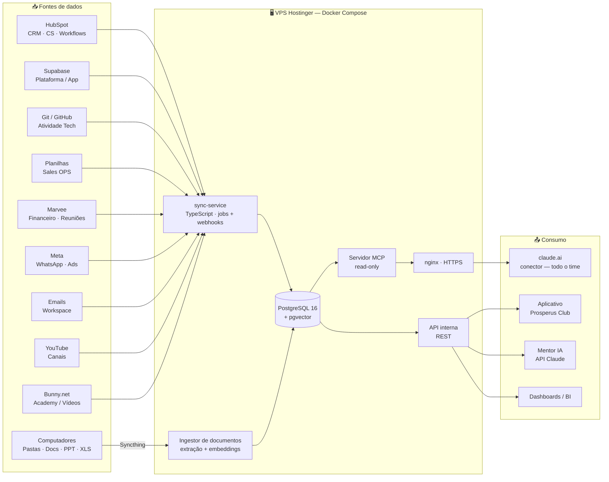

# Prosperus Data Hub

## Centralização de dados com IA para consultas sobre a Jornada do Cliente

> Documento de arquitetura — apresentação interna
> Times: Tecnologia · CS · Sales OPS · Vendas
> Infra: VPS Hostinger (Ubuntu 24.04 LTS, KVM 4 — 4 vCPU / 16 GB RAM)

> ⚠️ **Leia junto com o complemento [Data Hub — v2](./data-hub-prosperus-v2.md)** (levantamento de 11/08/2026): boa parte das Fases 1 e 2 já existe em produção — pgvector, conectores MCP por pessoa, resolução de identidade — e a v2 move o ponto de partida deste plano, além de listar as 4 decisões da Fase 0 que precisam sair antes de qualquer código.

---

## 1. Objetivo

Reunir os dados hoje espalhados entre CRM, plataforma, planilhas, comunicação e conteúdo em **um único banco central**, e disponibilizá-los em três formatos:

1. **Consultas em linguagem natural com IA** — qualquer pessoa do time pergunta "quais clientes fecharam em julho e abriram ticket em 30 dias?" e recebe a resposta com os números reais;
2. **APIs para as aplicações** — o aplicativo, o mentor IA, dashboards e automações consomem os mesmos dados;
3. **Visão única da jornada** — cada cliente tem uma linha do tempo completa: do anúncio que o trouxe até o engajamento no Academy e a renovação.

---

## 2. Arquitetura geral



**Decisões-chave:**

| Decisão | Escolha | Por quê |
|---|---|---|
| Banco central | **PostgreSQL 16 + pgvector** | Jornada é relacional (SQL preciso para a IA); pgvector adiciona busca semântica no mesmo banco — sem banco vetorial separado |
| ETL | **sync-service próprio em TypeScript** | Personalização total, tipagem ponta a ponta, versionado em git, code review — sem depender de ferramenta visual (n8n fica como complemento opcional futuro) |
| Camada de IA | **Servidor MCP read-only** | Mesmo padrão já validado com a Prosperus_KB: o time adiciona como conector no claude.ai e consulta em linguagem natural |
| Hospedagem | **VPS próprio (Docker Compose)** | Controle total, custo fixo, dados sensíveis em casa; KVM 4 comporta a stack completa |

---

## 3. Fontes de dados e forma de ingestão

### 3.1 Dados estruturados → tabelas SQL

| Fonte | O que entra | Como |
|---|---|---|
| **HubSpot** | Contatos, negócios, pipelines, tickets, atividades | API oficial — sync incremental + webhooks em tempo real |
| **Supabase** (plataforma/app) | Membros, acessos, eventos do app | Leitura direta Postgres → Postgres (caminho mais simples de todos) |
| **Git / GitHub** | Commits, PRs, issues | API do GitHub — atividade e entregas do time de tecnologia |
| **Planilhas** | Controles do Sales OPS | Google Sheets API (sync automático) ou upload |
| **Marvee** | Financeiro, agenda de reuniões | Endpoint de ingestão para os exports enviados |
| **Meta Ads** | Campanhas, custo, leads gerados | Marketing API — liga o topo do funil à jornada |
| **Bunny.net** | Views, watch time, geografia, banda por vídeo | Stream API — job diário de estatísticas |
| **YouTube** | Métricas dos canais, vídeos, comentários | Data API |
| **VPS** | Logs e eventos das aplicações | Coleta local |

### 3.2 Dados não estruturados → documentos + embeddings (busca semântica)

| Fonte | O que entra | Como |
|---|---|---|
| **Pastas de computadores** | Documentações, .docx, .pptx, .xlsx, .pdf, .txt | **Syncthing** nas máquinas (cada pessoa escolhe as pastas) → ingestor no VPS extrai texto, fatia e gera embeddings |
| **Emails** | Threads ligadas a clientes | Gmail/Workspace API — vinculação por remetente |
| **WhatsApp (Meta Cloud API)** | Conversas com clientes | Webhooks — viram eventos da jornada + texto pesquisável |
| **Marvee** | Transcrições de reuniões | Ingestão + embeddings |
| **YouTube / Academy** | Transcrições de vídeos | Extração + embeddings, vinculadas ao catálogo de aulas |

> **Pastas de computadores — como funciona:** nada é instalado "no banco". O Syncthing (open source, criptografado) sincroniza apenas as pastas escolhidas para `/data/inbox/<máquina>/` no VPS. O ingestor detecta arquivos novos/alterados por hash, extrai o texto e indexa com metadados (máquina, time, autor, data). A IA responde citando o arquivo e a pasta de origem. Alternativa sem instalar nada: sincronizar direto de pastas do Google Drive/OneDrive via API.

---

## 4. Modelo de dados central

O eixo do modelo é a **tabela de eventos da jornada**, alinhada às **10 fases da Jornada do Cliente Prosperus** (Marketing → Vendas → CS) já documentadas nos processos internos — as consultas da IA falam a mesma língua que o time.

```
clientes            registro unificado (dedupe por e-mail/CNPJ)
                    ├─ origem: HubSpot + Supabase + Planilhas
                    └─ visão 360°: tudo referencia cliente_id

eventos_jornada     ★ tabela central — linha do tempo
                    (cliente_id, fase_jornada, tipo_evento, data, origem, payload)
                    tipos: lead_criado, anuncio_clicado, call_realizada,
                    proposta, fechamento, onboarding, aula_iniciada,
                    aula_concluida, ticket_aberto, mensagem_whatsapp,
                    renovacao, churn ...

negocios            espelho dos deals do HubSpot (pipeline, etapa, valor)
tickets             CS / suporte
financeiro          entradas do Marvee (receita, inadimplência)

academy_videos      catálogo (video_id Bunny ↔ aula da Prosperus_KB)
academy_metricas    agregados diários do Bunny (views, watch time)
academy_eventos     consumo POR MEMBRO (instrumentado no app)

documentos          arquivos ingeridos (caminho, máquina, time, data, hash)
chunks              trechos + embedding vector — busca semântica
```

### Academy / Bunny.net — duas camadas de medição

1. **Bunny Stream API** mede o *vídeo*: views totais, tempo médio, geografia. Job diário → `academy_metricas`.
2. **Instrumentação no app** mede o *membro* (o dado que importa para a jornada): o player dispara `aula_iniciada`, `progresso 25/50/75%`, `aula_concluida` com `membro_id` → Supabase → banco central. O player embed do Bunny expõe a API Player.js (`play`, `timeupdate`, `ended`) — dá para capturar sem trocar de player.

Com o vínculo `video_id → aula da Prosperus_KB`, engajamento cruza com o mapa de dores/trilhas do Método PRIME.

---

## 5. Como consultar os dados

### 5.1 Time — linguagem natural via claude.ai (conector MCP)

Mesmo fluxo já usado com a Prosperus_KB: o servidor MCP do Data Hub é adicionado como conector e qualquer pessoa autorizada pergunta em português:

> *"Quais clientes fecharam em julho e abriram ticket nos 30 dias seguintes?"*
> *"Membros que não assistiram nada no Academy nos primeiros 14 dias têm quanto de churn a mais?"*
> *"Quem comprou há 30 dias e nunca acessou o Academy?"* → lista de ação para o CS
> *"O que a documentação do CS diz sobre onboarding?"* → cita arquivo e pasta de origem
> *"Membros com a dor X estão consumindo a trilha recomendada para essa dor?"*

Tools expostas pelo MCP (usuário de banco **somente leitura**):

| Tool | Função |
|---|---|
| `jornada_do_cliente(email)` | Linha do tempo completa de um cliente |
| `consultar_sql(pergunta)` | Consulta analítica (a IA escreve o SQL, com limites e views seguras) |
| `buscar_semantico(texto)` | Busca por significado em docs, e-mails, transcrições |
| `metricas_academy(periodo)` | Engajamento de conteúdo por aula/membro/coorte |

### 5.2 Aplicações — API interna REST

Para o app, dashboards e automações, os mesmos dados via endpoints tipados:

```
GET  /api/clientes/:id/jornada        linha do tempo do membro
GET  /api/academy/engajamento         consumo por membro/aula/coorte
GET  /api/jornada/funil?periodo=...   conversão fase a fase
POST /api/eventos                     ingestão de eventos (player do app, webhooks)
```

### 5.3 Mentor IA no aplicativo — API Claude + MCP connector

O backend chama a API do Claude apontando para os servidores MCP (Data Hub + Prosperus_KB). O Claude decide quais tools chamar e responde ao membro com contexto real — a jornada dele + o conteúdo recomendado:

```ts
const response = await client.beta.messages.create({
  model: "claude-opus-5",
  max_tokens: 16000,
  betas: ["mcp-client-2025-11-20"],
  mcp_servers: [
    { type: "url", name: "data-hub",     url: "https://<vps>/mcp" },
    { type: "url", name: "prosperus-kb", url: "https://prosperusclub.com.br/kb-mcp-…/mcp" },
  ],
  tools: [
    { type: "mcp_toolset", mcp_server_name: "data-hub" },
    { type: "mcp_toolset", mcp_server_name: "prosperus-kb" },
  ],
  system: "Você é o mentor Prosperus (Método PRIME). Consulte a jornada do membro e recomende aulas citando «Seção › Módulo › Título».",
  messages: [{ role: "user", content: perguntaDoMembro }],
});
```

> As chamadas rodam **sempre no backend** — URLs de MCP e chaves de API nunca vão ao navegador/app.

---

## 6. Segurança e LGPD

| Camada | Medida |
|---|---|
| Acesso da IA | Usuário Postgres **somente leitura**; a IA nunca escreve no banco |
| Perfis por time | Escopos no servidor MCP + views no Postgres — ex.: Vendas consulta jornada, mas não o financeiro do Marvee |
| Transporte | nginx com HTTPS (Let's Encrypt) + autenticação por token em todos os serviços expostos |
| PII / LGPD | E-mails e conversas de WhatsApp são dados pessoais: mascaramento nas views de consumo geral, política de retenção definida no schema, e minimização (só entra o que tem uso claro) |
| Pastas | Syncthing criptografado, sync apenas das pastas explicitamente escolhidas por cada pessoa |
| Backups | Dump diário do Postgres + retenção externa ao VPS |

---

## 7. Stack no VPS (Docker Compose)

| Serviço | Papel | Observação |
|---|---|---|
| `postgres` (16 + pgvector) | Banco central | Volume persistente + backup diário |
| `sync-service` (Node/TS) | ETL: jobs agendados + webhooks | node-cron/BullMQ, tabela `sync_log` |
| `ingestor` | Extração de docs + embeddings | Observa `/data/inbox/` |
| `mcp-server` | Camada IA (read-only) | Conector claude.ai + API Claude |
| `api` | REST para aplicações | Express (padrão atual do time) |
| `nginx` | HTTPS, roteamento, auth | Let's Encrypt |
| `syncthing` | Recepção das pastas | Somente LAN/dispositivos autorizados |

O KVM 4 (4 vCPU / 16 GB) comporta a stack completa com folga no volume atual de dados.

---

## 8. Fases de implantação

### Fase 1 — Núcleo da jornada *(valor imediato)*
- [ ] Docker Compose no VPS: Postgres + pgvector, nginx
- [ ] Schema central (clientes, eventos_jornada nas 10 fases, negócios, tickets)
- [ ] Sync **HubSpot** + **Supabase** + **Planilhas**
- [ ] **Academy**: job Bunny API + instrumentação do player no app
- [ ] Servidor MCP + conector no claude.ai para o time

### Fase 2 — Interações e financeiro
- [ ] **WhatsApp** (Meta Cloud API, webhooks)
- [ ] **Emails** (Workspace API)
- [ ] **Marvee** (financeiro + transcrições de reuniões)
- [ ] Perfis de acesso por time no MCP

### Fase 3 — Conhecimento e alcance
- [ ] **Pastas de computadores** (Syncthing + ingestor de documentos)
- [ ] **Git/GitHub** (atividade tech)
- [ ] **Meta Ads** + **YouTube** (topo de funil e conteúdo)
- [ ] Mentor IA no aplicativo (API Claude + MCP)
- [ ] Dashboards/BI

---

## 9. Resumo executivo

- **Um banco** (PostgreSQL + pgvector no VPS) recebe tudo: CRM, app, financeiro, conversas, conteúdo, documentos e engajamento do Academy.
- **Uma linha do tempo por cliente**, nas 10 fases da Jornada Prosperus — do anúncio à renovação.
- **Três portas de saída**: conector no claude.ai (time pergunta em português), API REST (aplicações) e API Claude (mentor IA no app).
- **Código próprio em TypeScript** para toda a integração — flexível, tipado, versionado, no padrão do time.
- **Read-only para a IA, perfis por time e LGPD** desenhados desde o schema.
